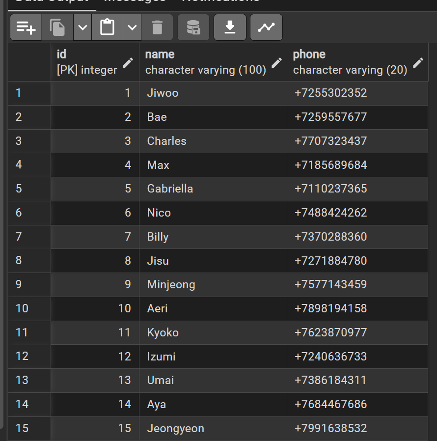

# Practice 7: PostgreSQL Phonebook
Application for contact management. Data stored in DB

```
Practice7/
├── config.py.example
├── connect.py
├── contacts.csv
├── db_result.png
├── generate_contacts.py
├── phonebook.py
└── README.md
```

### Screenshot of working DB:


### Technical Note
The connect.py script is designed to securely import credentials from config.py. For security reasons, the actual config.py file is excluded from this repository via .gitignore.